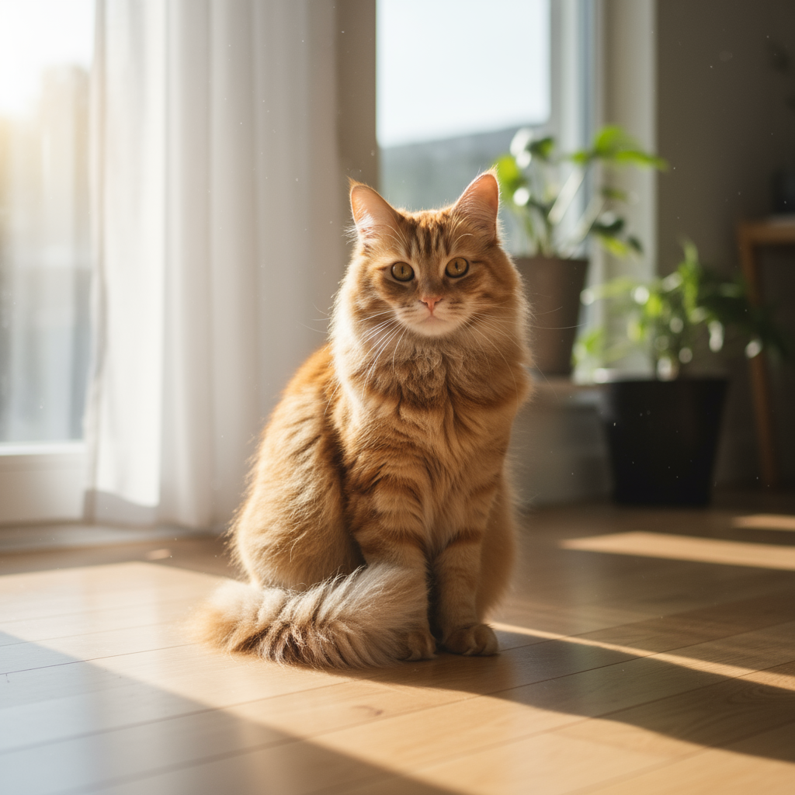
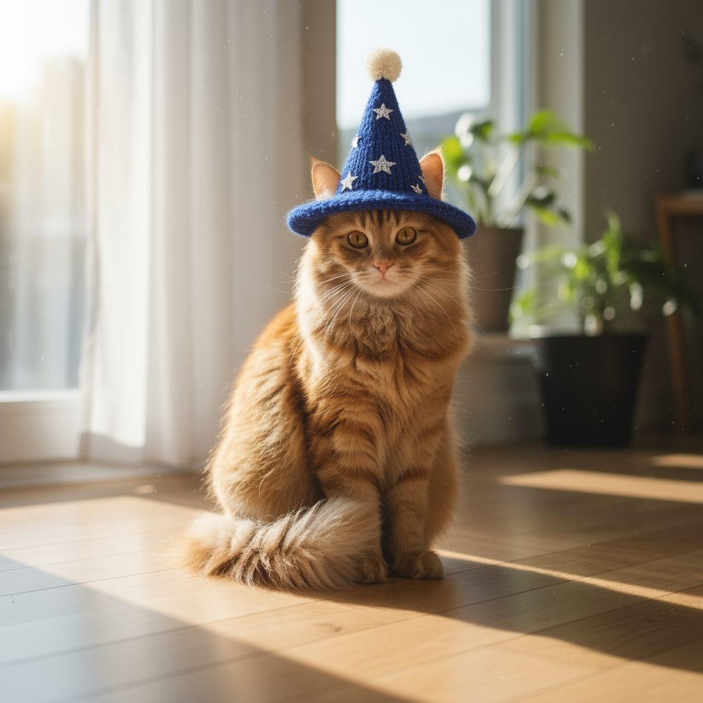
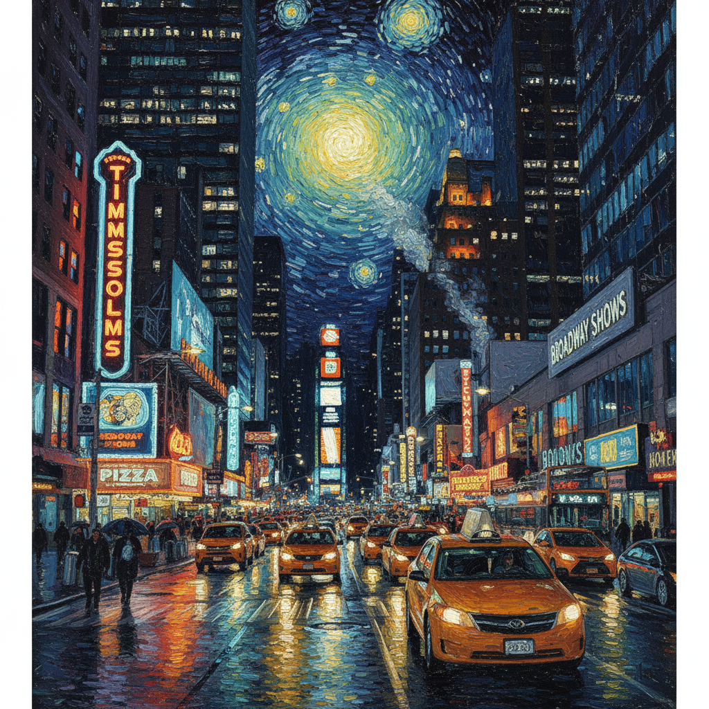
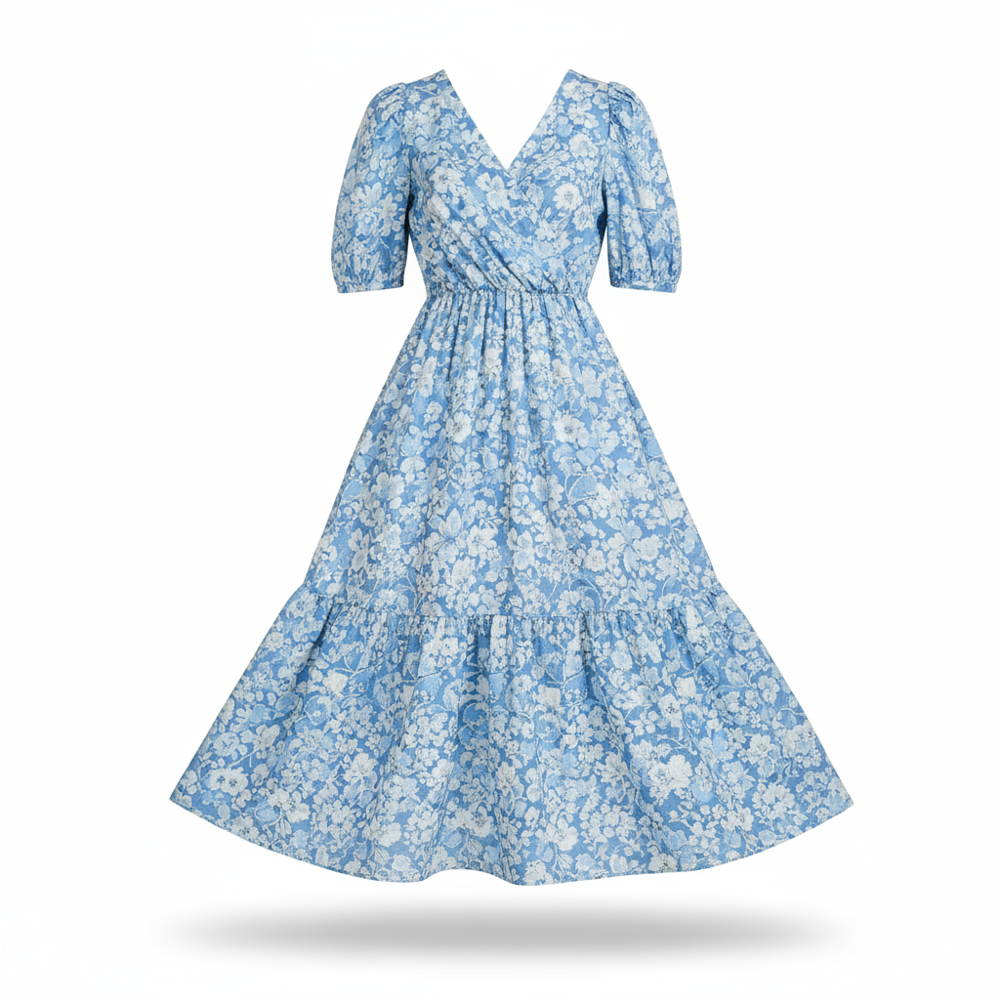

# Prompting Guide and Strategies
# 提示词指南与策略

Mastering Gemini 2.5 Flash Image Generation starts with one fundamental principle:
掌握 Gemini 2.5 Flash 图像生成的核心原则：

Describe the scene, don't just list keywords. The model's core strength is its deep language understanding. A narrative, descriptive paragraph will almost always produce a better, more coherent image than a list of disconnected words.
描述场景，而不仅仅是罗列关键词。模型的强大之处在于其对语言的深度理解。一个叙述性、描述性的段落几乎总能比一串不相关的词语生成更好、更连贯的图像。

## Prompts for generating images
## 图像生成提示词

The following strategies will help you create effective prompts to generate exactly the images you're looking for.
以下策略将帮助您创建有效的提示词，以生成您想要的精确图像。

### 1. Photorealistic scenes
### 照片级真实感场景

For realistic images, use photography terms. Mention camera angles, lens types, lighting, and fine details to guide the model toward a photorealistic result.
对于逼真的图像，请使用摄影术语。提及相机角度、镜头类型、光照和精细细节，以引导模型生成照片级真实感的结果。

**Template <br/> 模板**

```
A photorealistic [shot type] of [subject], [action or expression], set in [environment]. The scene is illuminated by [lighting description], creating
a [mood] atmosphere. Captured with a [camera/lens details], emphasizing [key textures and details]. The image should be in a [aspect ratio] format.
```

**Example <br/> 示例**

<div style="text-align: center;"></div>
A photorealistic close-up portrait of an elderly Japanese ceramicist...

**Prompt <br/> 提示词**

```
A photorealistic close-up portrait of an elderly Japanese ceramicist with deep, sun-etched wrinkles and a warm, knowing smile. He is carefully
inspecting a freshly glazed tea bowl. The setting is his rustic, sun-drenched workshop. The scene is illuminated by soft, golden hour light
streaming through a window, highlighting the fine texture of the clay. Captured with an 85mm portrait lens, resulting in a soft, blurred background
(bokeh). The overall mood is serene and masterful. Vertical portrait orientation.

一张年迈的日本陶艺师的特写肖像，脸上布满被阳光刻画的深邃皱纹，带着温暖而睿智的笑容。他正仔细检查一个新上釉的茶碗。场景是他质朴、阳光普照的工作室。柔和的金色阳光透过窗户倾泻而入，
照亮了粘土的细腻纹理。使用85毫米人像镜头拍摄，背景柔和模糊（焦外虚化）。整体氛围宁静而精湛。垂直人像构图。
```

### 2. Stylized illustrations & stickers
### 风格化插图和贴纸

To create stickers, icons, or assets, be explicit about the style and request a transparent background.
要创建贴纸、图标或素材，请明确指定风格并要求透明背景。

**Template <br/> 模板**

```
A [style] sticker of a [subject], featuring [key characteristics] and a [color palette]. The design should have [line style] and [shading style]. 
The background must be transparent.
```

**Example <br/> 示例**
<div style="text-align: center;"></div>
A kawaii-style sticker of a happy red panda...

**Prompt <br/> 提示词**

```
A kawaii-style sticker of a happy red panda wearing a tiny bamboo hat. It's munching on a green bamboo leaf. The design features bold, clean outlines,
simple cel-shading, and a vibrant color palette. The background must be white.

一张戴着小竹帽的快乐小熊猫的可爱风格贴纸。它正在啃食一片绿色的竹叶。设计特点是粗犷、干净的轮廓，简单的赛璐珞阴影，以及鲜艳的调色板。背景必须是白色。
```

### 3. Accurate text in images
### 在图像中生成准确的文本

Gemini excels at rendering text. Be clear about the text, the font style (descriptively), and the overall design.
Gemini 擅长渲染文本。请明确文本内容、字体风格（描述性地）和整体设计。

**Template <br/> 模板**

```
Create a [image type] for [brand/concept] with the text "[text to render]" in a [font style]. The design should be [style description], with a [color scheme].
```

**Example <br/> 示例**
<div style="text-align: center;"></div>
Create a modern, minimalist logo for a coffee shop called 'The Daily Grind'...

**Prompt <br/> 提示词**

```
Create a modern, minimalist logo for a coffee shop called 'The Daily Grind'.The text should be in a clean, bold, sans-serif font. The design should
feature a simple, stylized icon of a a coffee bean seamlessly integratedwith the text. The color scheme is black and white.

为一家名为“The Daily Grind”的咖啡店创建一个现代简约的标志。文字应采用干净、粗体、无衬线字体。设计应包含一个简单的、风格化的咖啡豆图标，与文字无缝融合。配色方案为黑白。
```

### 4. Product mockups & commercial photography
### 产品模型和商业摄影

Perfect for creating clean, professional product shots for e-commerce, advertising, or branding.
非常适合为电子商务、广告或品牌创建干净、专业的商品照片。

**Template <br/> 模板**

```
A high-resolution, studio-lit product photograph of a [product description] on a [background surface/description]. The lighting is a [lighting setup,
e.g., three-point softbox setup] to [lighting purpose]. The camera angle is a [angle type] to showcase [specific feature]. Ultra-realistic, with sharp focus on [key detail]. [Aspect ratio].
```

**Example <br/> 示例**
<div style="text-align: center;"></div>
A high-resolution, studio-lit product photograph of a minimalist ceramic coffee mug...

**Prompt <br/> 提示词**

```
A high-resolution, studio-lit product photograph of a minimalist ceramic coffee mug in matte black, presented on a polished concrete surface. The
lighting is a three-point softbox setup designed to create soft, diffused highlights and eliminate harsh shadows. The camera angle is a slightly
elevated 45-degree shot to showcase its clean lines. Ultra-realistic, with sharp focus on the steam rising from the coffee. Square image.

一张高分辨率、工作室灯光下的极简主义陶瓷咖啡杯产品照片，哑光黑色，置于抛光混凝土表面。灯光采用三点柔光箱设置，旨在营造柔和、漫射的高光并消除刺眼的阴影。相机角度为略微抬高的45度拍摄，
以展示其简洁的线条。超现实主义，对咖啡冒出的蒸汽有清晰的焦点。方形图像。
```

### 5. Minimalist & negative space design
### 极简主义与负空间设计

Excellent for creating backgrounds for websites, presentations, or marketing materials where text will be overlaid.
非常适合为网站、演示文稿或营销材料创建背景，以便在其上叠加文本。

**Template <br/> 模板**

```
A minimalist composition featuring a single [subject] positioned in the [bottom-right/top-left/etc.] of the frame. The background is a vast, empty
[color] canvas, creating significant negative space. Soft, subtle lighting. [Aspect ratio].
```

**Example <br/> 示例**
<div style="text-align: center;"></div>
A minimalist composition featuring a single, delicate red maple leaf...

**Prompt <br/> 提示词**

```
A minimalist composition featuring a single, delicate red maple leaf positioned in the bottom-right of the frame. The background is a vast, empty
off-white canvas, creating significant negative space for text. Soft, diffused lighting from the top left. Square image.

一个极简主义构图，画面右下角放置一片精致的红色枫叶。背景是广阔、空旷的米白色画布，为文本留出大量负空间。柔和、漫射的光线从左上方射入。方形图像。
```

### 6. Sequential art (Comic panel / Storyboard)
### 连环画艺术（漫画分镜/故事板）

Builds on character consistency and scene description to create panels for visual storytelling.
基于角色一致性和场景描述来创建用于视觉叙事的画格。

**Template <br/> 模板**

```
A single comic book panel in a [art style] style. In the foreground, [character description and action]. In the background, [setting details].
The panel has a [dialogue/caption box] with the text "[Text]". The lighting creates a [mood] mood. [Aspect ratio].
```

**Example <br/> 示例**
<div style="text-align: center;"></div>
A single comic book panel in a gritty, noir art style...

**Prompt <br/> 提示词**

```
A single comic book panel in a gritty, noir art style with high-contrast black and white inks. In the foreground, a detective in a trench coat stands
under a flickering streetlamp, rain soaking his shoulders. In the background, the neon sign of a desolate bar reflects in a puddle. A caption
box at the top reads "The city was a tough place to keep secrets." The lighting is harsh, creating a dramatic, somber mood. Landscape.

一个粗犷的黑色电影风格漫画分镜，采用高对比度的黑白墨水。前景中，一名穿着风衣的侦探站在闪烁的路灯下，雨水浸湿了他的肩膀。背景中，一家荒凉酒吧的霓虹灯招牌倒映在水坑中。顶部有一个标题框，写着“这座城市是一个难以保守秘密的地方。”灯光刺眼，营造出一种戏剧性、阴沉的氛围。横向。
```

## Prompts for editing images
## 图像编辑提示词

These examples show how to provide images alongside your text prompts for editing, composition, and style transfer.
这些示例展示了如何将图像与文本提示一起提供，以进行编辑、构图和风格迁移。

### 1. Adding and removing elements
### 添加和移除元素

Provide an image and describe your change. The model will match the original image's style, lighting, and perspective.
提供一张图像并描述您的更改。模型将匹配原始图像的风格、光照和视角。

**Template <br/> 模板**

```
Using the provided image of [subject], please [add/remove/modify] [element] to/from the scene. Ensure the change is [description of how the change should integrate].
```

<div style="display: flex; justify-content: space-around; align-items: center;">
  <div style="flex: 1; text-align: center; margin: 0 10px;">
    **Input | 输入**
    <br/>
    
  </div>
  <div style="flex: 1; text-align: center; margin: 0 10px;">
    Output
    <br/>
    
  </div>
</div>

**Example <br/> 示例**

A photorealistic picture of a fluffy ginger cat..

**Prompt <br/> 提示词**

```
"Using the provided image of my cat, please add a small, knitted wizard hat on its head. Make it look like it's sitting comfortably and matches the soft lighting of the photo."

“使用我提供的猫的图片，请在它的头上添加一顶小小的针织巫师帽。让它看起来舒适地坐着，并且与照片的柔和光线相匹配。”
```

### 2. Inpainting (Semantic masking)
### 图像修复（语义遮罩）

Conversationally define a "mask" to edit a specific part of an image while leaving the rest untouched.
通过对话定义一个“遮罩”，以编辑图像的特定部分，同时保持其余部分不变。

**Template <br/> 模板**

```
Using the provided image, change only the [specific element] to [new element/description]. Keep everything else in the image exactly the same,
preserving the original style, lighting, and composition.
```

<div style="display: flex; justify-content: space-around; align-items: center;">
  <div style="flex: 1; text-align: center; margin: 0 10px;">
    **Input | 输入**
    <br/>
    
  </div>
  <div style="flex: 1; text-align: center; margin: 0 10px;">
    Output
    <br/>
    
  </div>
</div>

**Example <br/> 示例**

A wide shot of a modern, well-lit living room...

**Prompt <br/> 提示词**

```
"Using the provided image of a living room, change only the blue sofa to be a vintage, brown leather chesterfield sofa. Keep the rest of the room,
including the pillows on the sofa and the lighting, unchanged."

“使用我提供的客厅图片，只将蓝色沙发改为复古的棕色皮革切斯特菲尔德沙发。保持房间的其他部分，包括沙发上的枕头和灯光，不变。”
```

### 3. Style transfer
### 风格迁移

Provide an image and ask the model to recreate its content in a different artistic style.
提供一张图像，并要求模型以不同的艺术风格重新创建其内容。

**Template <br/> 模板**

```
Transform the provided photograph of [subject] into the artistic style of [artist/art style]. Preserve the original composition but render it with [description of stylistic elements].
```

<div style="display: flex; justify-content: space-around; align-items: center;">
  <div style="flex: 1; text-align: center; margin: 0 10px;">
    **Input | 输入**
    <br/>
    
  </div>
  <div style="flex: 1; text-align: center; margin: 0 10px;">
    Output
    <br/>
    
  </div>
</div>

**Example <br/> 示例**

A photorealistic, high-resolution photograph of a busy city street...

**Prompt <br/> 提示词**

```
"Transform the provided photograph of a modern city street at night into the artistic style of Vincent van Gogh's 'Starry Night'. Preserve the original composition of buildings and cars, but render all elements with swirling, impasto brushstrokes and a dramatic palette of deep blues and bright yellows."

“将提供的现代城市夜景照片转换为文森特·梵高《星月夜》的艺术风格。保留建筑物和汽车的原始构图，但所有元素都以漩涡状、厚涂的笔触和深蓝色与亮黄色的戏剧性调色板呈现。”
```

### 4. Advanced composition: Combining multiple images
### 高级构图：组合多张图像

Provide multiple images as context to create a new, composite scene. This is perfect for product mockups or creative collages.
提供多张图像作为上下文，以创建新的复合场景。这非常适合产品模型或创意拼贴。

**Template <br/> 模板**

```
Create a new image by combining the elements from the provided images. Take the [element from image 1] and place it with/on the [element from image 2].
The final image should be a [description of the final scene].
```

<div style="display: flex; justify-content: space-around; align-items: center;">
  <div style="flex: 1; text-align: center; margin: 0 10px;">
    Input 1
    <br/>
    
  </div>
  <div style="flex: 1; text-align: center; margin: 0 10px;">
    Input 2 
    <br/>
    
  </div>
  <div style="flex: 1; text-align: center; margin: 0 10px;">
    Output
    <br/>
    
  </div>
</div>

**Example <br/> 示例**

A professionally shot photo of a blue floral summer dress...

**Prompt <br/> 提示词**

```
"Create a professional e-commerce fashion photo. Take the blue floral dress from the first image and let the woman from the second image wear it.
Generate a realistic, full-body shot of the woman wearing the dress, with the lighting and shadows adjusted to match the outdoor environment."

“创建一张专业的电子商务时尚照片。从第一张图片中取出蓝色碎花连衣裙，让第二张图片中的女士穿上它。生成一张女士穿着连衣裙的逼真全身照，并调整光线和阴影以匹配户外环境。”
```

### 5. High-fidelity detail preservation
### 高保真细节保留

To ensure critical details (like a face or logo) are preserved during an edit, describe them in great detail along with your edit request.
为了确保在编辑过程中保留关键细节（如面部或徽标），请在编辑请求中详细描述它们。

**Template <br/> 模板**

```
Using the provided images, place [element from image 2] onto [element from image 1]. Ensure that the features of [element from image 1] remain
completely unchanged. The added element should [description of how the element should integrate].
```

<div style="display: flex; justify-content: space-around; align-items: center;">
  <div style="flex: 1; text-align: center; margin: 0 10px;">
    **Input 1 **
    <br/>
    
  </div>
  <div style="flex: 1; text-align: center; margin: 0 10px;">
    **Input 2 **
    <br/>
    
  </div>
  <div style="flex: 1; text-align: center; margin: 0 10px;">
    Output
    <br/>
    
  </div>
</div>

**Example <br/> 示例**

A professional headshot of a woman with brown hair and blue eyes...

**Prompt <br/> 提示词**

```
"Take the first image of the woman with brown hair, blue eyes, and a neutral expression. Add the logo from the second image onto her black t-shirt.
Ensure the woman's face and features remain completely unchanged. The logo should look like it's naturally printed on the fabric, following the folds of the shirt."

“取第一张棕色头发、蓝色眼睛、表情中性的女士照片。将第二张照片中的标志添加到她的黑色T恤上。确保女士的面部特征完全不变。标志应看起来自然地印在布料上，并遵循T恤的褶皱。”
```